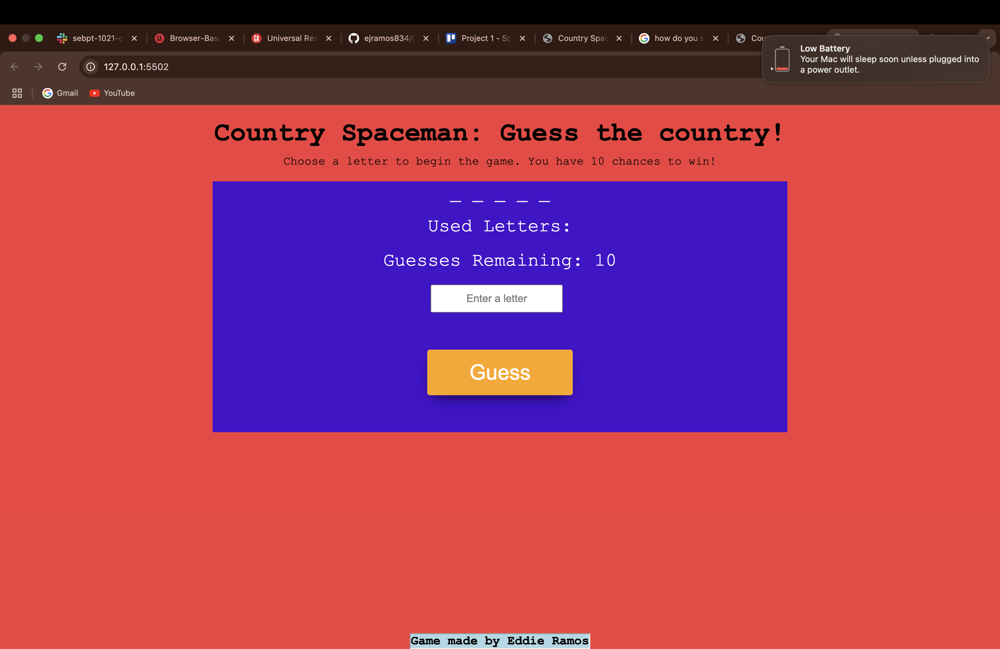

# Screenshot

# About my game!
My games name is Country Spaceman. The objective is to guess the correct country before you run out of guesses. Each time you play, you will recieve 10 guesses! It's simple but fun!

# Deployed game limk:
https://ejramos834.github.io/Country-Spaceman/

# Technologies used: 
    * CSS 
    * HTML 
    * Javascript

# Attributions:
https://developer.mozilla.org/en-US/docs/Web/JavaScript/Reference/Functions
https://developer.mozilla.org/en-US/docs/Web/JavaScript/Reference/Statements/if...else
https://www.w3schools.com/css/css3_buttons.asp

# Next Steps: 
In the future I want to make a little more interactive. I want to add an actual spaceman that pops up with the flag of the guessed country. I really want to figure out how to use images for styling. I will work on including some hints. I want to add a very start here page.